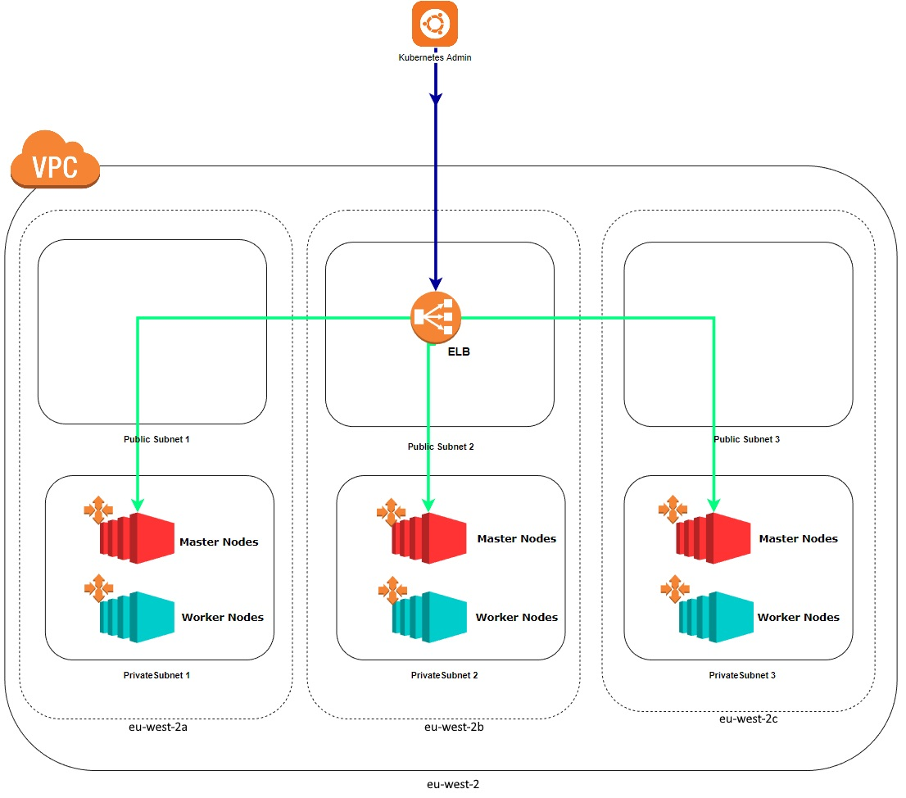

# Devops-Assessment

This repository includes an overview of the tools and methods used to complete the [assessment](https://github.com/Parkbee/assessment/tree/master/devops) as well as a [**step by step guide**](https://github.com/tik-png/Devops-Assessment#-implementation) to replicate the setup. 

# 🗺️ Solution description
## Arquitecture

When deploying the kubernetes cluster some aspects were taken into consideration:
* Scalability
* Self-Healing
* Monitorization
* Security
* High-Availability (simulate a production environment)

## Tools/Resources used

To deploy and manage the kubernetes cluster on the **AWS cloud** [Kops](https://github.com/kubernetes/kops) was used, it takes care of the k8s installation as well as the provisioning of the required cloud infrastructure*:
* Each node on the cluster is created as an **AWS EC2 instance**
* Kops also uses an **AWS S3 Bucket** for configuration storage

In order to store and access the docker images a public **AWS ECR** was used.

*Kops requires a **IAM user** with certain permissions, in my use case a user with full permissions was used so this wasn't an issue but in any case the required permissions and the assignment of a user to the EC2 Kops workspace can be checked [here](https://awsk8snetworkshops.com/prerequisites/kopscluster/kopsec2instance/).

## Cluster elements

The k8s cluster is composed of **3 master** and **3 worker nodes** (so to satisfy the "high-availability" concept) on 3 different zones. Kops creates a public **ELB** that exposes the k8s API, this access is only granted to the Kops worspace EC2 instance.
The whole cluster is private and on the same VPC.

## Some thoughts

* The AWS cloud aspect of this assessment consumed most of my time leaving me less time to spend on the k8s configurations
* To monitor the k8s cluster instead of just the metrics server we could deploy a prometheus/grafana setup with alarmistic
* Terraform has some integrations with Kops, implementing the cluster with it would probably faster, I did some experiments but decided to fallback to just using Kops

# 🚀 Implementation

The implementation is divided into 3 segments:
* [Setup EC2 instance workspace](./workspace)
* [Configure and deploy the k8s cluster using Kops](./kops)
* [Configure and deploy the kubernetes services](./kubernetes)