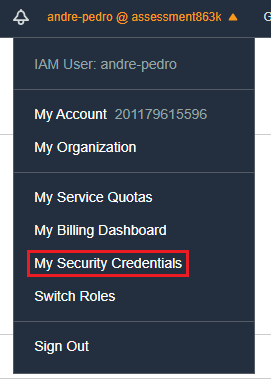
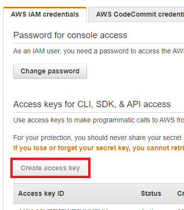

# Setup EC2 instance workspace

In this section we will launch an EC2 instance and install the required tools to start using Kops.

### Generate an access key for an IAM user

* Login to the AWS Management Console as the IAM user


* Go to AWS IAM credentials > Access keys for CLI, SDK, & API access > Create access key
* Download and save the .csv file containing the **Access key ID** and the **Secret access key**


### Launch and access an EC2 instance

* On the AWS Management Console navigate to the EC2 instances page and click on "Launch instances"
* Launch one instance of **Ubuntu Server 20.04 LTS 64-bit** type **t2.micro** on the default VPC (leave everything else default), when prompted create a new key pair and save the private key file.
* You can now access this instance throught ssh using the private key with the user "ubuntu" and the public IPv4 of the EC2 instance (`ssh -i private_key.pem ubuntu@x.x.x.x`), you may need to change the key file permissions i.e. on a linux system `chmod 400 private_key.pem`

### Install Kubeadmin, Docker, AWS cli and Kops

* Clone this git repository `git clone https://github.com/tik-png/Devops-Assessment.git`
* Install the required tools by either executing the script located at Devops-Assessment/workspace/setup.sh (`cd Devops-Assessment/workspace && chmod +x setup.sh && ./setup.sh`) or manually running each command (you can see it [here](./setup.sh))

### Configure and validate AWS cli

* There are different ways of providing the AWS credentials to AWS cli (throught config files or interactive setup), for the sake of simplicity we'll export these variables:
```console
export AWS_ACCESS_KEY_ID=
export AWS_SECRET_ACCESS_KEY=
export AWS_DEFAULT_REGION=eu-west-2
export AWS_DEFAULT_OUTPUT=json
```
Fill in the AWS_ACCESS_KEY_ID and AWS_SECRET_ACCESS_KEY with the keys obtained in the [Create IAM user and generate an access key](https://github.com/tik-png/Devops-Assessment/tree/main/workspace#generate-an-access-key-for-an-iam-user) step.
* Validate the AWS user: `aws iam get-user`
<p align="right">
    <a href="https://github.com/tik-png/Devops-Assessment/tree/main/kops">Next: Configure and deploy the k8s cluster using Kops ▶️</a>
</p>
